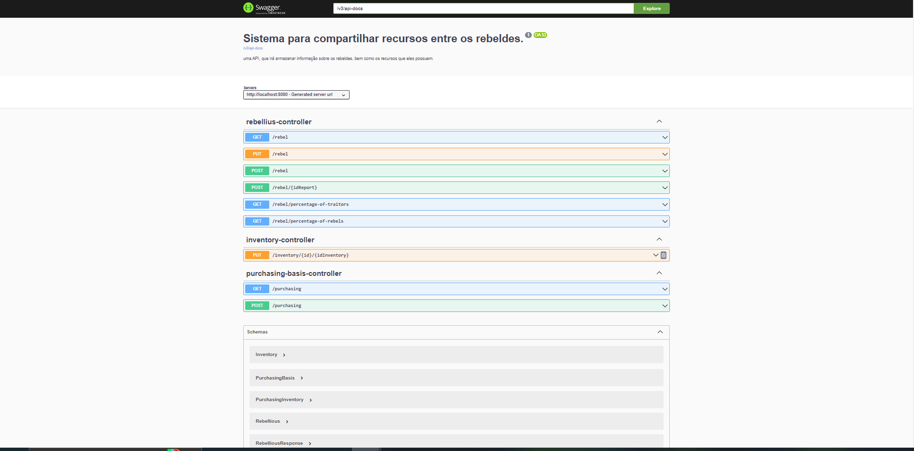

# Sistema de Compartilhamento de Recursos - Resistência Galáctica

O Sistema de Compartilhamento de Recursos da Resistência Galáctica é uma API projetada para gerenciar
informações sobre os rebeldes e os recursos que eles possuem, bem como para relatar traidores na resistência.
Este sistema permite adicionar rebeldes, atualizar suas localizações, reportar rebeldes como traidores e oferece
relatórios sobre a porcentagem de traidores e rebeldes ativos.
## Funcionalidades
O sistema inclui as seguintes funcionalidades:

### Rebeldes
- Cadastrar um rebelde com as seguintes informações:
    - Nome
    - Idade
    - Gênero
    - Localização (nome da base)
    - Inventário de recursos em sua posse, incluindo itens como armas, munição, água e comida.
- Atualizar Localização do Rebelde
    - Permitir que um rebelde atualize sua localização, indicando o nome da nova base.
- Reportar Rebelde como Traidor
    - Um rebelde pode ser marcado como traidor quando, pelo menos, três outros rebeldes reportam sua traição.
    - Um rebelde marcado como traidor se torna inativo e não pode mais fazer compras na base.
### Relatórios
- A API oferece os seguintes relatórios:
    - Porcentagem de traidores entre os rebeldes.
    - Porcentagem de rebeldes ativos.

### Base de Compras
Os rebeldes podem comprar itens na base usando recursos que possuem.
- Itens disponíveis na base de compras com seus respectivos valores:
    - Arma: 100 recursos
    - Munição: 30 recursos
    - Água: 5 recursos
    - Comida: 15 recursos

### Documentação com Swagger
- Com o programa rodando basta entrar em : http://localhost:8080/swagger-ui/index.html#/ e visualizar o swagger

## Como Executar
Para executar o sistema, siga estas etapas:

1. Clone o repositório para o seu ambiente local.
2. Configure o banco de dados PostgreSQL de acordo com as configurações no arquivo `application.properties`.
3. Abra o projeto em sua IDE preferida (como IntelliJ IDEA ou Eclipse).
4. Execute o aplicativo principal, que geralmente é encontrado em `src/main/kotlin/com/exemplo/Main.kt`.

## Linguagem de uso: **Java**
Um trecho de código escrito em Java:
~~~Java
public class VoteTraitors {
  @Id @GeneratedValue(strategy = GenerationType.IDENTITY)
  private Long id;
}
~~~
### **Pessoa Autora**
Ana Julia Alves Ferreira
* [GitHub](https://github.com/AnaJuliaSilverio/)

Ana Flavia dos Reis
* [GitHub](https://github.com/AnaBern034/)

Raissa Vicente Dias
* [GitHub](https://github.com/RaiVD)